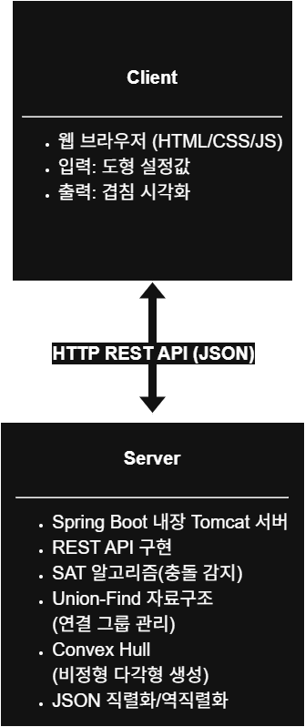

# Shape Overlap SpringBoot

2D 공간에서 다양한 기하학적 도형들의 겹침을 감지하고 시각화하는 웹 기반 시스템입니다. 컴퓨터 그래픽스와 게임 개발에서 중요한 충돌 감지(Collision Detection) 기술을 구현한 프로젝트입니다.

👉 [포트폴리오 문서 보기 (Notion)](https://www.notion.so/Shape-Overlap-SpringBoot-201fa5704878801080eee3165d58cb92?pvs=4)

## 📋 프로젝트 개요

이 프로젝트는 원, 볼록 정다각형, 볼록 비정형 다각형을 무작위로 생성하고 이들 간의 겹침을 정확하게 감지합니다. SAT(Separating Axis Theorem) 알고리즘과 Union-Find 자료구조를 활용하여 연쇄적 그룹화를 통해 연결된 도형 집합을 식별하고 시각적으로 표현합니다.

### 주요 특징

- 🎯 **정확한 충돌 감지**: 도형별 최적화된 알고리즘 적용
- 🔗 **연쇄적 그룹화**: Union-Find로 연결된 도형들을 하나의 그룹으로 관리
- 🎨 **실시간 시각화**: HTML5 Canvas를 통한 직관적인 결과 표시
- 📊 **통계 정보**: 겹침 그룹 수, 도형 개수 등을 버튼 입력에 따라 업데이트
- 🌐 **RESTful API**: JSON 기반의 구조화된 데이터 제공

## 🚀 설치 및 실행 방법

### 1. 사전 요구사항

이 프로젝트는 Java 21을 기반으로 개발되었습니다. 실행을 위해 다음 환경이 필요합니다:

- **Java Development Kit (JDK) 21**
- **IntelliJ IDEA** 또는 **Eclipse IDE** (권장)

### 2. 실행 방법

1. `release/shape-overlap-springboot-0.0.1-SNAPSHOT.jar` 파일을 준비합니다.
2. 터미널(명령 프롬프트)에서 다음 명령어를 입력합니다:

```bash
java -jar release/shape-overlap-springboot-0.0.1-SNAPSHOT.jar

```

애플리케이션이 시작되면 브라우저에서 `http://localhost:8080`으로 접속하세요.

## 🎮 주요 기능과 사용법

### 1. 도형 생성 및 설정

- **Shape Count**: 생성할 도형의 수를 지정 (기본값: 50개)
- **Max Radius**: 도형의 최대 크기 설정 (기본값: 50px)
- **Max Edges**: 다각형의 최대 모서리 개수 조절 (기본값: 15개)

### 2. 겹침 감지 및 그룹화

- 생성된 도형들 간의 겹침을 자동으로 감지
- 연쇄적으로 겹친 도형들을 동일한 색상으로 그룹화
- 통계 정보 표시 (총 도형 수, 도형별 개수, 겹침 도형 및 그룹 수)

### 3. API 사용법

```bash
# REST API 호출 예시
"http://localhost:8080/api?Action=ShapesOverlaps&Width=800&Height=600&RadiusMax=50&HowMany=30&MaxEdges=12"

```

**응답 구조:**

```json
{
  "RES": {
    "STATUS": 200,
    "STATUS_MSG": "OK",
    "ACTION": "ShapesOverlaps",
    "RESULT": {
      "overlapGroups": [...],
      "shapes": [...],
      "totalCount": 30
    }
  },
  "REQ": {...}
}

```

## 🛠 기술 스택

### Backend

- **Java 21**: 메인 개발 언어
- **Spring Boot 3.5.0**: 웹 애플리케이션 프레임워크
- **Spring Web MVC**: REST API 구현
- **JSON Library**: 데이터 직렬화/역직렬화

### Frontend

- **Vanilla JavaScript (ES6+)** — 클라이언트 로직 구현
- **HTML5 Canvas API** — 도형 렌더링
- **CSS3** — 스타일 및 반응형 디자인
- **Fetch API** — 백엔드와 비동기 통신

### 핵심 알고리즘

- **SAT (Separating Axis Theorem)**: 볼록 다각형 간 충돌 감지
- **Union-Find**: 연쇄적 그룹화 및 연결 요소 탐지
- **Convex Hull**: 비정형 다각형 생성 시 볼록성 보장
- **기하학적 충돌 감지**: 원-원, 원-다각형 간 최적화된 알고리즘

## 📁 프로젝트 구조

```
src/
└── main/
    ├── java/
    │   └── knu/lsy/
    │       ├── API.java                              # REST Controller
    │       ├── BACKEND_MANAGER.java                  # 비즈니스 로직 분기
    |       ├── ShapeOverlapSpringbootApplication     # 메인 메서드
    │       ├── utils/
    |       |   ├── CollisionUtil.java                # 충돌 감지 유틸리티
    │       |   └── MathUtil.java                     # EPSILON 상수 및 수학 유틸리티
    │       └── shapes/
    |           ├── ShapeGenerator.java               # 핵심 알고리즘 처리
    │           ├── Shape.java                        # 추상 도형 클래스
    │           ├── Circle.java                       # 원 도형
    │           ├── RegularPolygon.java               # 정다각형
    │           └── IrregularPolygon.java             # 비정형 다각형
    └── resources/
        └── static/
            ├── index.html                            # 메인 웹 페이지 및 스타일
            └── script.js                             # 프론트엔드 로직

```

### 아키텍처 개요



### 핵심 클래스 설명

- **API.java**: REST API 엔드포인트 처리 및 JSON 응답 구조화
- **ShapeGenerator.java**: 도형 생성, 겹침 감지, 그룹화 통합 처리
- **CollisionUtil.java**: 도형별 최적화된 충돌 감지 알고리즘 구현
- **Shape 계층**: 다형성을 활용한 도형별 객체 구현

## 📄 라이선스

이 프로젝트는 MIT 라이선스 하에 배포됩니다. 자세한 내용은 [LICENSE](./LICENSE) 파일을 참조하세요.